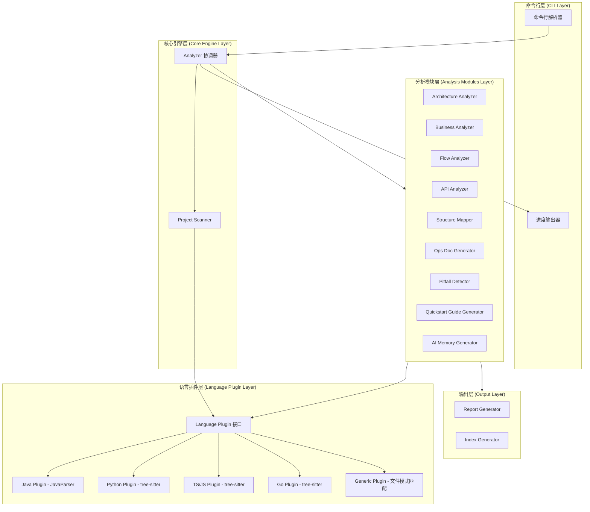
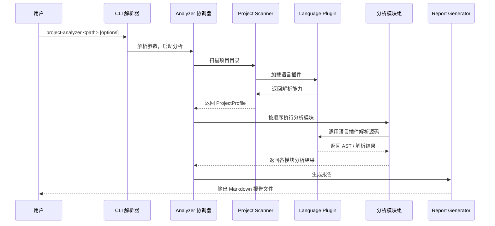
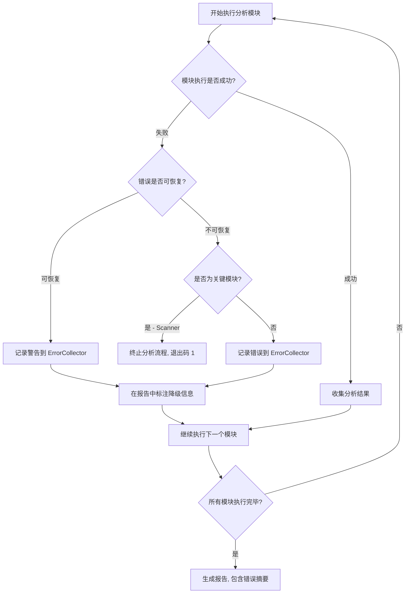

# 技术设计文档 - Project Analyzer

## 概述 (Overview)

Project Analyzer 是一套双版本命令行工具，用于自动化分析新接手项目的整体情况。工具从技术架构、业务功能、主要流程、接口路径等多个维度进行深度分析，并生成结构化的 Markdown 报告和 AI 可检索的知识库文件。

### 双版本架构决策

| 维度 | Java 版本 (project-analyzer-java) | TypeScript 版本 (project-analyzer-ts) |
|------|-----------------------------------|---------------------------------------|
| 目标语言 | Java 项目 | Python、JavaScript/TypeScript、Go 等 |
| 运行时 | JVM (Java 17+) | Node.js (18+) |
| AST 解析 | JavaParser (3.26+) | tree-sitter + 语言 grammar 包 |
| 包管理 | Maven | npm |
| 入口命令 | `project-analyzer-java <path>` | `project-analyzer <path>` |

**选择理由**：
- Java 版本使用 [JavaParser](https://github.com/javaparser/javaparser)（支持 Java 1-25 的原生 AST 解析），可实现最精准的 Java 代码分析，包括注解解析、类型推断和依赖注入追踪。
- TypeScript 版本使用 [tree-sitter](https://github.com/tree-sitter/tree-sitter)（增量解析库），通过加载不同语言的 grammar 包实现跨语言解析，覆盖 Python、JavaScript/TypeScript、Go 等语言。
- 两个版本共享相同的报告格式、命令行参数和退出码规范，确保一致的用户体验。

## 架构 (Architecture)

### 整体架构

两个版本采用相同的分层架构设计，仅在底层解析实现上有所不同：



### 执行流程



## 组件与接口 (Components and Interfaces)

### 1. Language Plugin 接口

这是整个系统的核心抽象，两个版本都必须实现此接口：

**Java 版本 (Interface)**:
```java
// 作者: hjl
public interface LanguagePlugin {
    /** 获取支持的语言标识 */
    String getLanguageId();

    /** 解析源码文件，返回 AST 节点列表 */
    List<AstNode> parseFile(Path filePath);

    /** 从项目中提取依赖信息 */
    List<Dependency> extractDependencies(Path projectRoot);

    /** 识别 API 接口定义 */
    List<ApiEndpoint> identifyApis(Path filePath);

    /** 识别模块划分 */
    List<ModuleInfo> identifyModules(Path projectRoot);
}
```

**TypeScript 版本 (Interface)**:
```typescript
// 作者: hjl
export interface LanguagePlugin {
  getLanguageId(): string;
  parseFile(filePath: string): AstNode[];
  extractDependencies(projectRoot: string): Dependency[];
  identifyApis(filePath: string): ApiEndpoint[];
  identifyModules(projectRoot: string): ModuleInfo[];
}
```

### 2. Analyzer 协调器

负责协调整个分析流程：

```typescript
// 作者: hjl
export interface AnalyzerConfig {
  projectPath: string;
  outputDir: string;
  modules: AnalysisModule[];  // 要执行的分析模块
  lang?: string;              // 覆盖自动检测的语言
}

export interface Analyzer {
  run(config: AnalyzerConfig): Promise<AnalysisReport>;
}
```

### 3. Project Scanner

```typescript
// 作者: hjl
export interface ProjectScanner {
  scan(projectPath: string): Promise<ProjectProfile>;
}
```

### 4. 分析模块接口

所有分析模块实现统一接口：

```typescript
// 作者: hjl
export interface AnalysisModuleInterface {
  getName(): string;
  analyze(profile: ProjectProfile, plugins: LanguagePlugin[]): Promise<ModuleResult>;
}
```

具体模块列表：
- `ArchitectureAnalyzer` — 技术架构分析
- `BusinessAnalyzer` — 业务功能分析
- `FlowAnalyzer` — 主要流程分析
- `ApiAnalyzer` — 接口路径分析
- `StructureMapper` — 项目结构地图
- `OpsDocGenerator` — 启动/部署/配置说明书
- `PitfallDetector` — 坑点检测
- `QuickstartGuideGenerator` — 接手速查手册
- `AiMemoryGenerator` — AI 项目记忆

### 5. Report Generator

```typescript
// 作者: hjl
export interface ReportGenerator {
  generate(report: AnalysisReport, outputDir: string): Promise<ReportFiles>;
}

export interface ReportFiles {
  indexFile: string;           // README.md
  reportFiles: string[];      // 各报告文件路径
}
```


### 6. Java 版本组件接口

以下为 Java 版本中各核心组件的接口定义，与 TypeScript 版本的接口一一对应：

**Analyzer 协调器 (Java)**:
```java
// 作者: hjl
public interface Analyzer {
    AnalysisReport run(AnalyzerConfig config) throws AnalysisException;
}

public class AnalyzerConfig {
    private String projectPath;
    private String outputDir;
    private List<AnalysisModule> modules;
    private String lang;  // 可选，覆盖自动检测

    // getters, setters, builder 省略
}
```

**Project Scanner (Java)**:
```java
// 作者: hjl
public interface ProjectScanner {
    ProjectProfile scan(String projectPath) throws AnalysisException;
}
```

**分析模块接口 (Java)**:
```java
// 作者: hjl
public interface AnalysisModuleInterface {
    String getName();
    ModuleResult analyze(ProjectProfile profile, List<LanguagePlugin> plugins) throws AnalysisException;
}
```

**Report Generator (Java)**:
```java
// 作者: hjl
public interface ReportGenerator {
    ReportFiles generate(AnalysisReport report, String outputDir) throws AnalysisException;
}

public class ReportFiles {
    private String indexFile;
    private List<String> reportFiles;

    // getters, setters 省略
}
```

**Architecture Analyzer (Java)**:
```java
// 作者: hjl
public interface ArchitectureAnalyzer extends AnalysisModuleInterface {
    /** 解析依赖配置文件并提取依赖信息 */
    List<Dependency> parseDependencies(Path configFile);

    /** 将依赖按类别分组 */
    Map<DependencyCategory, List<Dependency>> groupDependencies(List<Dependency> dependencies);

    /** 识别项目分层结构 */
    List<LayerInfo> identifyLayers(ProjectProfile profile, List<LanguagePlugin> plugins);
}
```

**Business Analyzer (Java)**:
```java
// 作者: hjl
public interface BusinessAnalyzer extends AnalysisModuleInterface {
    /** 识别业务功能模块 */
    List<ModuleInfo> identifyBusinessModules(ProjectProfile profile, List<LanguagePlugin> plugins);

    /** 提取数据模型定义 */
    List<DataModelInfo> extractDataModels(ProjectProfile profile, List<LanguagePlugin> plugins);
}
```

**Flow Analyzer (Java)**:
```java
// 作者: hjl
public interface FlowAnalyzer extends AnalysisModuleInterface {
    /** 识别入口点 */
    List<EntryPoint> identifyEntryPoints(ProjectProfile profile, List<LanguagePlugin> plugins);

    /** 对入口点进行调用链分析 */
    FlowTrace traceCallChain(EntryPoint entryPoint, int maxDepth);
}
```

**API Analyzer (Java)**:
```java
// 作者: hjl
public interface ApiAnalyzer extends AnalysisModuleInterface {
    /** 提取 API 接口定义 */
    List<ApiEndpoint> extractEndpoints(ProjectProfile profile, List<LanguagePlugin> plugins);

    /** 按模块分组 */
    List<ApiGroup> groupEndpoints(List<ApiEndpoint> endpoints);
}
```

**Structure Mapper (Java)**:
```java
// 作者: hjl
public interface StructureMapper extends AnalysisModuleInterface {
    /** 生成目录树 */
    DirectoryNode buildDirectoryTree(String projectPath, OpsConfig config);

    /** 生成模块关系图 */
    MermaidGraph buildModuleDiagram(ProjectProfile profile);
}
```

**Ops Doc Generator (Java)**:
```java
// 作者: hjl
public interface OpsDocGenerator extends AnalysisModuleInterface {
    /** 识别启动方式 */
    List<StartupInfo> identifyStartupMethods(ProjectProfile profile);

    /** 提取配置项 */
    List<ConfigItem> extractConfigItems(ProjectProfile profile);

    /** 识别外部依赖服务 */
    List<ExternalService> identifyExternalServices(ProjectProfile profile);

    /** 生成环境配置对照表 */
    EnvComparisonTable compareEnvironments(ProjectProfile profile);
}
```

**Pitfall Detector (Java)**:
```java
// 作者: hjl
public interface PitfallDetector extends AnalysisModuleInterface {
    /** 检测反模式 */
    List<PitfallRecord> detectAntiPatterns(List<AstNode> nodes, OpsConfig config);

    /** 检测漏洞依赖 */
    List<PitfallRecord> detectVulnerableDependencies(List<Dependency> dependencies);

    /** 检测标记注释 */
    List<PitfallRecord> detectTodoMarkers(List<AstNode> nodes);

    /** 检测硬编码配置 */
    List<PitfallRecord> detectHardcodedConfigs(List<AstNode> nodes);
}
```

**Quickstart Guide Generator (Java)**:
```java
// 作者: hjl
public interface QuickstartGuideGenerator extends AnalysisModuleInterface {
    /** 生成接手速查手册 */
    QuickstartResult generateGuide(AnalysisReport report);
}
```

**AI Memory Generator (Java)**:
```java
// 作者: hjl
public interface AiMemoryGenerator extends AnalysisModuleInterface {
    /** 生成 AI 记忆数据 */
    AiMemoryData generateMemoryData(AnalysisReport report);

    /** 版本差异对比 */
    AiMemoryDiff compareVersions(AiMemoryData oldVersion, AiMemoryData newVersion);
}
```

## 数据模型 (Data Models)

### ProjectProfile（项目概况）

```typescript
// 作者: hjl
export interface ProjectProfile {
  projectName: string;
  projectPath: string;
  primaryLanguage: string;
  languages: LanguageStat[];
  buildTool: BuildToolType;
  modules: SubModule[];
  fileStats: FileStats;
}

export interface LanguageStat {
  language: string;
  fileCount: number;
  lineCount: number;
  percentage: number;  // 占比
}

export type BuildToolType =
  | 'maven' | 'gradle'
  | 'npm' | 'yarn' | 'pnpm'
  | 'pip' | 'poetry'
  | 'go-mod'
  | 'unknown';

export interface SubModule {
  name: string;
  path: string;
  language: string;
  buildTool: BuildToolType;
}

export interface FileStats {
  totalFiles: number;
  sourceFiles: number;
  testFiles: number;
  configFiles: number;
  totalLines: number;
}
```

### Dependency（依赖信息）

```typescript
// 作者: hjl
export interface Dependency {
  name: string;
  version: string;
  group?: string;        // Java: groupId
  category: DependencyCategory;
  scope: DependencyScope;
}

export type DependencyCategory =
  | 'web-framework' | 'database' | 'cache'
  | 'message-queue' | 'security' | 'testing'
  | 'logging' | 'utility' | 'other';

export type DependencyScope =
  | 'compile' | 'runtime' | 'test' | 'provided';
```

### AstNode（AST 节点）

```typescript
// 作者: hjl
export interface AstNode {
  type: AstNodeType;
  name: string;
  filePath: string;
  startLine: number;
  endLine: number;
  modifiers: string[];       // public, private, static, etc.
  annotations: Annotation[];
  children: AstNode[];
  parameters?: Parameter[];  // 方法参数
  returnType?: string;       // 方法返回类型
  superClass?: string;       // 父类
  interfaces?: string[];     // 实现的接口
}

export type AstNodeType =
  | 'class' | 'interface' | 'enum'
  | 'method' | 'constructor'
  | 'field' | 'function'
  | 'module' | 'namespace';

export interface Annotation {
  name: string;
  attributes: Record<string, string>;
}

export interface Parameter {
  name: string;
  type: string;
  annotations: Annotation[];
}
```

### ApiEndpoint（API 接口）

```typescript
// 作者: hjl
export interface ApiEndpoint {
  path: string;
  method: HttpMethod;
  handlerClass: string;
  handlerMethod: string;
  parameters: ApiParameter[];
  responseType?: string;
  description?: string;
  tags: string[];
}

export type HttpMethod = 'GET' | 'POST' | 'PUT' | 'DELETE' | 'PATCH' | 'HEAD' | 'OPTIONS';

export interface ApiParameter {
  name: string;
  type: string;
  in: 'path' | 'query' | 'body' | 'header';
  required: boolean;
  description?: string;
}
```

### ModuleInfo（模块信息）

```typescript
// 作者: hjl
export interface ModuleInfo {
  name: string;
  path: string;
  description: string;
  isInferred: boolean;  // 是否为推断结果
  keyClasses: string[];
  keyFiles: string[];
  dependencies: string[];  // 依赖的其他模块名
}
```

### FlowTrace（流程追踪）

```typescript
// 作者: hjl
export interface FlowTrace {
  entryPoint: EntryPoint;
  callChain: CallStep[];
  maxDepth: number;
  description: string;
}

export interface EntryPoint {
  type: 'controller' | 'main' | 'event-handler' | 'scheduled' | 'other';
  className: string;
  methodName: string;
  filePath: string;
  httpPath?: string;
}

export interface CallStep {
  depth: number;
  className: string;
  methodName: string;
  filePath: string;
  line: number;
  isExternal: boolean;  // 是否为外部依赖调用
  description?: string;
}
```

### PitfallRecord（坑点记录）

```typescript
// 作者: hjl
export interface PitfallRecord {
  category: PitfallCategory;
  severity: 'high' | 'medium' | 'low';
  filePath: string;
  line?: number;
  description: string;
  suggestion: string;
}

export type PitfallCategory =
  | 'anti-pattern'       // 反模式
  | 'deprecated-dep'     // 废弃依赖
  | 'security-risk'      // 安全风险
  | 'todo-marker'        // TODO/FIXME 标记
  | 'code-style'         // 编码风格不一致
  | 'hardcoded-config'   // 硬编码配置
  | 'missing-test';      // 缺少测试
```

### AnalysisReport（分析报告）

```typescript
// 作者: hjl
export interface AnalysisReport {
  metadata: ReportMetadata;
  profile: ProjectProfile;
  architecture?: ArchitectureResult;
  business?: BusinessResult;
  flows?: FlowResult;
  apis?: ApiResult;
  structure?: StructureResult;
  ops?: OpsResult;
  pitfalls?: PitfallResult;
  quickstart?: QuickstartResult;
  aiMemory?: AiMemoryResult;
}

export interface ReportMetadata {
  generatedAt: string;       // ISO 8601 时间戳
  analyzerVersion: string;
  analyzerType: 'java' | 'ts';
  projectName: string;
}
```

### AiMemoryData（AI 记忆数据）

```typescript
// 作者: hjl
export interface AiMemoryData {
  version: string;
  generatedAt: string;
  projectMeta: {
    name: string;
    language: string;
    framework: string;
    buildTool: string;
  };
  modules: AiModuleInfo[];
  apis: AiApiInfo[];
  glossary: GlossaryEntry[];
  codeNavigation: CodeNavEntry[];
}

export interface AiModuleInfo {
  name: string;
  purpose: string;
  coreClasses: {
    name: string;
    publicMethods: string[];
    dependencies: string[];
  }[];
}

export interface GlossaryEntry {
  term: string;
  definition: string;
  relatedCode: string[];  // 类名/方法名
}

export interface CodeNavEntry {
  feature: string;
  files: string[];
  methods: string[];
}
```

### ArchitectureResult（技术架构分析结果）

```typescript
// 作者: hjl
export interface ArchitectureResult {
  dependencies: Dependency[];
  dependencyGroups: Record<DependencyCategory, Dependency[]>;
  layers: LayerInfo[];
  frameworks: FrameworkInfo[];
  moduleDependencyGraph?: MermaidGraph;
}

export interface LayerInfo {
  name: string;           // 如 "Controller", "Service", "Repository"
  pattern: string;        // 匹配模式
  classes: string[];
  files: string[];
}

export interface FrameworkInfo {
  name: string;           // 如 "Spring Boot", "MyBatis"
  version?: string;
  category: string;       // 如 "web", "orm", "security"
  evidence: string[];     // 识别依据（依赖名、注解等）
}

export interface MermaidGraph {
  syntax: string;         // 完整的 Mermaid 语法字符串
  nodes: string[];
  edges: { from: string; to: string; label?: string }[];
}
```

### BusinessResult（业务功能分析结果）

```typescript
// 作者: hjl
export interface BusinessResult {
  modules: ModuleInfo[];
  dataModels: DataModelInfo[];
}

export interface DataModelInfo {
  name: string;
  type: 'entity' | 'model' | 'dto' | 'vo' | 'other';
  filePath: string;
  fields: DataFieldInfo[];
  description?: string;
}

export interface DataFieldInfo {
  name: string;
  type: string;
  annotations: string[];
  description?: string;
}
```

### FlowResult（流程分析结果）

```typescript
// 作者: hjl
export interface FlowResult {
  entryPoints: EntryPoint[];
  flows: FlowTrace[];
}
```

### ApiResult（接口分析结果）

```typescript
// 作者: hjl
export interface ApiResult {
  endpoints: ApiEndpoint[];
  groups: ApiGroup[];
  totalCount: number;
}

export interface ApiGroup {
  name: string;           // Controller 名或模块名
  basePath?: string;
  endpoints: ApiEndpoint[];
}
```

### StructureResult（项目结构分析结果）

```typescript
// 作者: hjl
export interface StructureResult {
  directoryTree: DirectoryNode;
  moduleDiagram?: MermaidGraph;
  subModuleDependencies?: MermaidGraph;
}

export interface DirectoryNode {
  name: string;
  path: string;
  type: 'directory' | 'file';
  children: DirectoryNode[];
  fileCount: number;          // 目录下文件总数（含子目录）
  annotation?: string;        // 功能标注，如 "入口文件"、"配置目录"、"测试目录"、"核心业务模块"
  isCollapsed: boolean;       // 是否折叠显示
  isAutoGenerated: boolean;   // 是否为自动生成的目录（build、dist、node_modules 等）
  depth: number;              // 目录深度
}
```

### OpsResult（启动/部署/配置分析结果）

```typescript
// 作者: hjl
export interface OpsResult {
  startup: StartupInfo[];
  containers?: ContainerConfig[];
  cicd?: CiCdPipeline[];
  configItems: ConfigItem[];
  externalServices: ExternalService[];
  envComparison?: EnvComparisonTable;
}

export interface StartupInfo {
  method: 'main-class' | 'script' | 'npm-script' | 'makefile' | 'other';
  command: string;
  description: string;
  filePath: string;
  isInferred: boolean;    // 是否为推断结果
}

export interface ContainerConfig {
  type: 'dockerfile' | 'docker-compose';
  filePath: string;
  baseImage?: string;
  ports: string[];
  volumes: string[];
  envVars: string[];
  services?: string[];    // docker-compose 中的服务列表
  description: string;
}

export interface CiCdPipeline {
  type: 'github-actions' | 'gitlab-ci' | 'jenkins' | 'other';
  filePath: string;
  stages: CiCdStage[];
  description: string;
}

export interface CiCdStage {
  name: string;
  steps: string[];
  triggers?: string[];
}

export interface ConfigItem {
  key: string;
  defaultValue?: string;
  description: string;
  required: boolean;
  source: string;         // 来源配置文件路径
  environment?: string;   // 所属环境（dev/test/prod），无则为通用
}

export interface ExternalService {
  name: string;           // 如 "MySQL", "Redis", "RabbitMQ"
  type: 'database' | 'cache' | 'message-queue' | 'search-engine' | 'third-party-api' | 'other';
  evidence: string[];     // 识别依据（依赖名、配置项等）
  connectionConfig?: string;  // 连接配置项名称
}

export interface EnvComparisonTable {
  environments: string[];     // 环境名列表，如 ["dev", "test", "prod"]
  items: EnvComparisonItem[];
}

export interface EnvComparisonItem {
  key: string;
  values: Record<string, string | undefined>;  // 环境名 -> 配置值
  isDifferent: boolean;   // 各环境间是否存在差异
}
```

### QuickstartResult（接手速查手册结果）

```typescript
// 作者: hjl
export interface QuickstartResult {
  fiveMinuteOverview: {
    purpose: string;
    techStack: string[];
    coreModules: string[];
    startupCommand: string;
  };
  devSetupSteps: string[];
  businessOverview: BusinessOverviewEntry[];
  warnings: PitfallRecord[];       // 仅严重程度为 "high" 的坑点
  apiQuickRef?: ApiQuickRefEntry[];
}

export interface BusinessOverviewEntry {
  moduleName: string;
  description: string;
  keyFiles: string[];
  relatedApis: string[];
}

export interface ApiQuickRefEntry {
  path: string;
  method: HttpMethod;
  description: string;
}
```

### PitfallResult（坑点分析结果）

```typescript
// 作者: hjl
export interface PitfallResult {
  records: PitfallRecord[];
  summary: {
    total: number;
    byCategory: Record<PitfallCategory, number>;
    bySeverity: Record<'high' | 'medium' | 'low', number>;
  };
}
```

### AiMemoryResult（AI 记忆生成结果）

```typescript
// 作者: hjl
export interface AiMemoryResult {
  memoryData: AiMemoryData;
  jsonFilePath: string;
  markdownFilePath: string;
}
```

### AiApiInfo（AI 记忆中的接口信息）

```typescript
// 作者: hjl
export interface AiApiInfo {
  path: string;
  method: HttpMethod;
  description: string;
  parameters: {
    name: string;
    type: string;
    in: 'path' | 'query' | 'body' | 'header';
  }[];
  responseModel?: string;
  businessContext: string;   // 业务语义说明
  relatedModule: string;     // 所属业务模块
}
```

### OpsConfig（Ops 分析配置）

```typescript
// 作者: hjl
export interface OpsConfig {
  /** 反模式检测阈值配置 */
  antiPatternThresholds: {
    maxMethodLines: number;       // 过长方法阈值，默认 80 行
    maxNestingDepth: number;      // 过深嵌套阈值，默认 4 层
    maxClassMethods: number;      // God Class 方法数阈值，默认 20
    maxClassLines: number;        // God Class 行数阈值，默认 500 行
    maxFileLines: number;         // 过长文件阈值，默认 1000 行
  };
  /** 已知的自动生成目录名 */
  autoGeneratedDirs: string[];    // 默认: ["build", "dist", "node_modules", "target", ".gradle", "__pycache__"]
  /** 目录树最大展示深度 */
  maxTreeDepth: number;           // 默认: 5
}
```

### 退出码规范（双版本共享）

| 退出码 | 含义 |
|--------|------|
| 0 | 分析成功完成 |
| 1 | 分析过程中发生错误 |
| 2 | 命令行参数错误 |

### 命令行参数规范（双版本共享）

| 参数 | 缩写 | 说明 | 默认值 |
|------|------|------|--------|
| `--output <dir>` | `-o` | 指定输出目录 | `./analysis-reports/` |
| `--modules <list>` | `-m` | 指定分析模块（逗号分隔） | 全部模块 |
| `--lang <language>` | `-l` | 覆盖自动检测的语言 | 自动检测 |
| `--help` | `-h` | 显示帮助信息 | - |
| `--version` | `-v` | 显示版本信息 | - |

可选模块值：`architecture`, `business`, `flow`, `api`, `structure`, `ops`, `pitfall`, `quickstart`, `ai-memory`


## 正确性属性 (Correctness Properties)

*属性（Property）是指在系统所有有效执行中都应成立的特征或行为——本质上是对系统应做什么的形式化陈述。属性是人类可读规范与机器可验证正确性保证之间的桥梁。*

### Property 1: 项目扫描完整性与 ProjectProfile 一致性

*For any* 有效的项目目录结构，Project Scanner 扫描后生成的 ProjectProfile 应满足：(a) 文件清单包含目录中所有源码文件且无遗漏，(b) 主要语言识别与文件扩展名统计中占比最高的语言一致，(c) 构建工具识别与实际存在的构建配置文件一致，(d) 文件统计数据（totalFiles、sourceFiles 等）与实际文件数量一致。

**Validates: Requirements 1.1, 1.2, 1.3, 1.4**

### Property 2: 依赖分类正确性

*For any* 依赖列表，依赖分类器将每个依赖分配到的类别应与该依赖的已知类别一致，且每个依赖恰好属于一个类别。

**Validates: Requirements 2.2**

### Property 3: 数据模型提取一致性

*For any* 包含数据模型定义（Entity/Model/DTO 类）的源码文件，Business Analyzer 提取的模型名称和字段列表应与源码中的定义完全一致——即提取后的模型信息可以与原始 AST 定义进行对照验证。

**Validates: Requirements 3.4**

### Property 4: 调用链深度约束

*For any* 入口点和调用图，Flow Analyzer 生成的调用链深度不应超过 5 层，且链中每一步的调用关系应在调用图中存在。

**Validates: Requirements 4.2**

### Property 5: API 接口提取完整性

*For any* 包含 HTTP API 注解/装饰器的源码文件集合，API Analyzer 提取的接口列表应满足：(a) 每个带有 HTTP 注解的方法都被识别，(b) 每个接口记录包含完整路径、HTTP 方法、参数和响应类型，(c) 接口按所属 Controller/模块正确分组，(d) 路径中的动态参数被正确标注。

**Validates: Requirements 5.1, 5.2, 5.3, 5.6**

### Property 6: 报告生成完整性

*For any* 有效的 AnalysisReport，Report Generator 应生成所有指定的 Markdown 报告文件，且每份报告都包含生成时间、项目名称和分析工具版本信息。

**Validates: Requirements 6.1, 6.2**

### Property 7: 索引文档完整性

*For any* 生成的报告文件集合，汇总索引文档（README.md）应包含每份报告的相对链接和简要说明，且链接数量与报告文件数量一致。

**Validates: Requirements 6.4**

### Property 8: 命令行参数解析正确性

*For any* 有效的命令行参数组合（包含 --output、--modules、--lang 的任意组合），参数解析器应正确提取所有参数值，且解析结果与输入参数一一对应。

**Validates: Requirements 8.3**

### Property 9: 目录树生成完整性与标注正确性

*For any* 项目目录结构，Structure Mapper 生成的目录树应包含所有目录和文件，且关键目录（入口文件、配置目录、测试目录等）被正确标注功能类型。

**Validates: Requirements 9.1, 9.4**

### Property 10: 模块依赖图有效性

*For any* 包含模块依赖关系的项目，Structure Mapper 生成的 Mermaid 格式依赖图应是有效的 Mermaid 语法，且图中的节点和边与实际模块依赖关系一致。

**Validates: Requirements 9.2, 9.3**

### Property 11: 目录折叠规则

*For any* 目录结构，(a) 深度超过 5 层的目录应被折叠（仅展示关键路径），(b) 自动生成的目录（build、dist、node_modules 等）应被标注为"自动生成"并默认折叠。

**Validates: Requirements 9.5, 9.6**

### Property 12: 代码模式检测完整性

*For any* 包含已知标记注释（TODO/FIXME/HACK/XXX）或硬编码配置值的源码文件，Pitfall Detector 应识别所有此类模式，且每个检测到的坑点记录包含完整信息（类别、严重程度、文件路径、行号、描述和建议修复方案）。

**Validates: Requirements 11.3, 11.5, 11.6**

### Property 13: 接手速查手册结构与过滤正确性

*For any* 有效的分析结果，Quickstart Guide Generator 生成的手册应满足：(a) 包含所有必要章节（5 分钟速览、开发环境搭建、核心业务速览、注意事项），(b) "核心业务速览"和"接口速查表"以表格形式列出所有模块/接口，(c) "注意事项"章节仅包含严重程度为"高"的坑点。

**Validates: Requirements 12.1, 12.2, 12.4, 12.5, 12.6**

### Property 14: AI 记忆数据序列化 round-trip

*For any* 有效的 AiMemoryData 对象，序列化为 JSON 后再反序列化应得到等价的对象，且 JSON 文件包含版本标识和生成时间戳。

**Validates: Requirements 13.1, 13.6**

### Property 15: AI 记忆版本差异对比

*For any* 两个版本的 AiMemoryData，差异对比应正确标注新增、修改和删除的内容，且 diff(v1, v2) 中标注为"新增"的条目不存在于 v1 中，标注为"删除"的条目不存在于 v2 中。

**Validates: Requirements 13.8**

### Property 16: Ops 信息提取完整性

*For any* 包含启动脚本（main 函数、npm scripts、Makefile 等）、容器化配置（Dockerfile、docker-compose.yml）或 CI/CD 配置文件（Jenkinsfile、.github/workflows、.gitlab-ci.yml）的项目，Ops Doc Generator 提取的结果应满足：(a) 所有启动方式都被识别且包含命令和描述，(b) 容器配置中的基础镜像、端口映射、卷挂载等关键信息被完整提取，(c) CI/CD 流水线的所有阶段和步骤被正确解析。

**Validates: Requirements 10.1, 10.2, 10.3**

### Property 17: 配置项提取完整性

*For any* 有效的配置文件（application.yml、.env、config.json 等），Ops Doc Generator 提取的配置项列表应与原始配置文件中的键值对一一对应，且每个配置项包含名称、默认值、用途说明和是否必填信息。

**Validates: Requirements 10.4**

### Property 18: 环境配置对照表正确性

*For any* 包含多个环境配置文件（dev、test、prod）的项目，Ops Doc Generator 生成的环境配置对照表应满足：(a) 对照表中每个配置项在每个环境中的值与对应环境配置文件中的实际值一致，(b) 标注为"存在差异"的配置项确实在不同环境间有不同的值。

**Validates: Requirements 10.6**

### Property 19: 反模式检测阈值正确性

*For any* 源码文件集合和给定的阈值配置（maxMethodLines、maxNestingDepth、maxClassMethods、maxClassLines），Pitfall Detector 的反模式检测应满足：(a) 方法行数超过 maxMethodLines 的方法被标记为"过长方法"，(b) 嵌套深度超过 maxNestingDepth 的代码块被标记为"过深嵌套"，(c) 方法数或行数超过阈值的类被标记为"God Class"，(d) 未超过阈值的代码不被误报。

**Validates: Requirements 11.1**

### Property 20: 漏洞依赖检测正确性

*For any* 依赖列表和已知漏洞数据库，Pitfall Detector 应正确识别所有存在已知安全漏洞或已废弃的依赖，且每个被标记的依赖都确实存在于漏洞数据库中，未被标记的依赖确实不在漏洞数据库中。

**Validates: Requirements 11.2**

### Property 21: 双版本输出格式一致性

*For any* 有效的 AnalysisReport 数据，Java 版本和 TypeScript 版本的 Report Generator 生成的报告应满足：(a) Markdown 报告具有相同的章节结构和字段定义，(b) AI 记忆 JSON 文件符合相同的 JSON Schema 结构，(c) 控制台进度信息和分析摘要具有相同的输出格式。

**Validates: Requirements 14.1, 14.2, 14.5**


## 报告模板规范 (Report Template Specification)

### 文件命名规范

所有报告文件统一使用以下命名规范，双版本必须一致：

| 报告类型 | 文件名 | 说明 |
|----------|--------|------|
| 汇总索引 | `README.md` | 所有报告的链接和简要说明 |
| 项目概览 | `01-project-overview.md` | 项目基本信息和统计 |
| 技术架构 | `02-architecture.md` | 技术栈、依赖、分层结构 |
| 业务功能 | `03-business.md` | 业务模块划分和功能描述 |
| 主要流程 | `04-flows.md` | 核心业务流程和调用链 |
| 接口路径 | `05-apis.md` | API 接口完整列表 |
| 项目结构地图 | `06-structure.md` | 目录树和模块关系图 |
| 启动/部署/配置 | `07-ops.md` | 启动方式、部署流程、配置项 |
| 坑点笔记 | `08-pitfalls.md` | 潜在问题和技术债务 |
| 接手速查手册 | `09-quickstart.md` | 综合性快速参考手册 |
| AI 项目记忆 (JSON) | `ai-memory.json` | 结构化 JSON 知识库 |
| AI 上下文摘要 | `ai-context.md` | Markdown 格式 AI 上下文 |

### 报告通用头部模板

每份 Markdown 报告必须包含以下头部信息：

```markdown
# {报告标题}

> 项目名称: {projectName}
> 生成时间: {generatedAt}
> 分析工具: Project Analyzer {analyzerType} v{analyzerVersion}

---
```

### 各报告章节结构

#### 项目概览报告 (`01-project-overview.md`)

```markdown
# 项目概览

## 基本信息
- 项目名称、路径、主要语言、构建工具

## 语言统计
| 语言 | 文件数 | 代码行数 | 占比 |

## 文件统计
- 总文件数、源码文件、测试文件、配置文件、总代码行数

## 子模块列表
| 模块名 | 路径 | 语言 | 构建工具 |
```

#### 技术架构报告 (`02-architecture.md`)

```markdown
# 技术架构分析

## 核心框架与技术
| 框架 | 版本 | 类别 | 识别依据 |

## 依赖清单
### {类别名}
| 依赖名 | 版本 | 作用域 |

## 分层结构
| 层级 | 匹配模式 | 包含类/文件数 |

## 模块依赖图
（Mermaid 图）
```

#### 业务功能报告 (`03-business.md`)

```markdown
# 业务功能分析

## 业务模块
### {模块名}
- 功能描述
- 关键类/文件列表
- 依赖模块

## 数据模型
### {模型名}
| 字段名 | 类型 | 注解 | 说明 |
```

#### 主要流程报告 (`04-flows.md`)

```markdown
# 主要流程分析

## 入口点列表
| 类型 | 类名 | 方法名 | 文件 | HTTP 路径 |

## 流程详情
### {流程描述}
调用链:
1. {类名}.{方法名} (depth=1)
2. {类名}.{方法名} (depth=2) [外部依赖]
...
```

#### 接口路径报告 (`05-apis.md`)

```markdown
# 接口路径分析

## 接口统计
- 总接口数: {totalCount}

## 接口列表
### {分组名} ({basePath})
| 路径 | 方法 | 参数 | 响应类型 | 描述 |
```

#### 项目结构地图 (`06-structure.md`)

```markdown
# 项目结构地图

## 目录树
（树形结构，含功能标注和文件数统计）

## 模块关系图
（Mermaid 图）

## 子模块依赖图
（Mermaid 图）
```

#### 启动/部署/配置说明书 (`07-ops.md`)

```markdown
# 启动/部署/配置说明书

## 启动方式
### {启动方式名}
- 命令: {command}
- 说明: {description}
- 来源: {filePath}

## 容器化部署
### {容器配置类型}
- 基础镜像、端口、卷挂载等

## CI/CD 流水线
### {流水线类型}
| 阶段 | 步骤 | 触发条件 |

## 配置项清单
| 配置项 | 默认值 | 说明 | 必填 | 来源 |

## 外部依赖服务
| 服务名 | 类型 | 识别依据 | 连接配置 |

## 环境配置对照表
| 配置项 | dev | test | prod | 差异 |
```

#### 坑点笔记 (`08-pitfalls.md`)

```markdown
# 坑点笔记

## 统计摘要
| 类别 | 高 | 中 | 低 |

## 坑点详情
### [{severity}] {category}: {description}
- 文件: {filePath}:{line}
- 建议: {suggestion}
```

#### 接手速查手册 (`09-quickstart.md`)

```markdown
# 接手速查手册

## 5 分钟速览
- 项目用途、技术栈、核心模块、启动方式

## 开发环境搭建
1. 步骤 1
2. 步骤 2
...

## 核心业务速览
| 模块 | 功能描述 | 关键文件 | 相关接口 |

## 注意事项
（仅高严重程度的坑点）

## 接口速查表
| 路径 | 方法 | 功能描述 |
```

### AI 记忆 JSON Schema

```json
{
  "$schema": "http://json-schema.org/draft-07/schema#",
  "type": "object",
  "required": ["version", "generatedAt", "projectMeta", "modules", "apis", "glossary", "codeNavigation"],
  "properties": {
    "version": { "type": "string" },
    "generatedAt": { "type": "string", "format": "date-time" },
    "projectMeta": {
      "type": "object",
      "required": ["name", "language", "framework", "buildTool"],
      "properties": {
        "name": { "type": "string" },
        "language": { "type": "string" },
        "framework": { "type": "string" },
        "buildTool": { "type": "string" }
      }
    },
    "modules": {
      "type": "array",
      "items": { "$ref": "#/definitions/AiModuleInfo" }
    },
    "apis": {
      "type": "array",
      "items": { "$ref": "#/definitions/AiApiInfo" }
    },
    "glossary": {
      "type": "array",
      "items": { "$ref": "#/definitions/GlossaryEntry" }
    },
    "codeNavigation": {
      "type": "array",
      "items": { "$ref": "#/definitions/CodeNavEntry" }
    }
  }
}
```


## 错误处理设计 (Error Handling)

### 错误类型定义

```typescript
// 作者: hjl
export type AnalysisErrorCode =
  | 'INVALID_PATH'           // 路径无效（不存在或非目录）
  | 'EMPTY_PROJECT'          // 项目为空或无可识别源码
  | 'PARSE_ERROR'            // 源码解析失败
  | 'PLUGIN_NOT_FOUND'       // 语言插件未找到
  | 'PLUGIN_ERROR'           // 语言插件执行错误
  | 'MODULE_ERROR'           // 分析模块执行错误
  | 'REPORT_WRITE_ERROR'     // 报告写入失败
  | 'CONFIG_PARSE_ERROR'     // 配置文件解析失败
  | 'DEPENDENCY_PARSE_ERROR' // 依赖文件解析失败
  | 'TIMEOUT_ERROR'          // 分析超时
  | 'UNKNOWN_ERROR';         // 未知错误

export interface AnalysisError {
  code: AnalysisErrorCode;
  message: string;
  module?: string;          // 发生错误的模块名
  filePath?: string;        // 相关文件路径
  cause?: Error;            // 原始异常
  recoverable: boolean;     // 是否可恢复（降级处理）
}
```

**Java 版本**:
```java
// 作者: hjl
public class AnalysisException extends Exception {
    private final AnalysisErrorCode code;
    private final String module;
    private final String filePath;
    private final boolean recoverable;

    public AnalysisException(AnalysisErrorCode code, String message, boolean recoverable) {
        super(message);
        this.code = code;
        this.module = null;
        this.filePath = null;
        this.recoverable = recoverable;
    }

    public AnalysisException(AnalysisErrorCode code, String message, String module, String filePath, boolean recoverable, Throwable cause) {
        super(message, cause);
        this.code = code;
        this.module = module;
        this.filePath = filePath;
        this.recoverable = recoverable;
    }

    // getters 省略
}

public enum AnalysisErrorCode {
    INVALID_PATH,
    EMPTY_PROJECT,
    PARSE_ERROR,
    PLUGIN_NOT_FOUND,
    PLUGIN_ERROR,
    MODULE_ERROR,
    REPORT_WRITE_ERROR,
    CONFIG_PARSE_ERROR,
    DEPENDENCY_PARSE_ERROR,
    TIMEOUT_ERROR,
    UNKNOWN_ERROR
}
```

### 降级策略

系统采用"尽力而为"的降级策略，确保单个模块的失败不会导致整个分析流程中断：

| 错误场景 | 对应需求 | 降级策略 | 退出码 |
|----------|----------|----------|--------|
| 路径无效 | 1.5 | 立即终止，输出错误信息 | 1 |
| 项目为空 | 1.6 | 立即终止，输出提示信息 | 1 |
| 单个源码文件解析失败 | - | 跳过该文件，记录警告，继续分析 | 0 |
| 语言插件未找到 | 7.5 | 使用通用分析策略（Generic Plugin），在报告中标注 | 0 |
| 单个分析模块执行失败 | 6.6, 12.7 | 跳过该模块，在对应报告中说明原因 | 0 |
| 配置文件解析失败 | 10.7 | 基于项目类型推断，标注为"推断结果" | 0 |
| 依赖文件解析失败 | - | 跳过依赖分析，在报告中说明 | 0 |
| 报告写入失败 | - | 重试一次，仍失败则终止 | 1 |
| 命令行参数错误 | 8.7 | 显示帮助信息 | 2 |

### 错误报告格式

分析过程中的所有错误和警告会被收集并在分析摘要中输出：

```
[ERROR] {module}: {message} ({filePath})
[WARN]  {module}: {message} ({filePath})
[INFO]  {module}: {message}
```

### 错误收集器接口

```typescript
// 作者: hjl
export interface ErrorCollector {
  addError(error: AnalysisError): void;
  addWarning(error: AnalysisError): void;
  getErrors(): AnalysisError[];
  getWarnings(): AnalysisError[];
  hasErrors(): boolean;
  hasFatalErrors(): boolean;  // 是否有不可恢复的错误
}
```

**Java 版本**:
```java
// 作者: hjl
public interface ErrorCollector {
    void addError(AnalysisException error);
    void addWarning(AnalysisException warning);
    List<AnalysisException> getErrors();
    List<AnalysisException> getWarnings();
    boolean hasErrors();
    boolean hasFatalErrors();
}
```

### 模块级错误处理流程




## 测试策略 (Testing Strategy)

### 双重测试方法

- **单元测试**: 验证具体示例、边界条件和错误处理
- **属性测试**: 验证跨所有输入的通用属性

### 属性测试配置

- 属性测试库: TypeScript 版本使用 `fast-check`，Java 版本使用 `jqwik`
- 每个属性测试最少运行 100 次迭代
- 每个属性测试必须引用设计文档中的属性编号
- 标签格式: **Feature: project-analyzer, Property {number}: {property_text}**

### 测试覆盖矩阵

| 需求 | 属性测试 | 单元测试 | 集成测试 |
|------|----------|----------|----------|
| Req 1: 项目扫描 | Property 1 | 路径无效、空项目 | 真实项目扫描 |
| Req 2: 架构分析 | Property 2 | 特定框架识别 | - |
| Req 3: 业务分析 | Property 3 | 推断结果标注 | - |
| Req 4: 流程分析 | Property 4 | 外部依赖标注 | - |
| Req 5: 接口分析 | Property 5 | Swagger 注解提取 | - |
| Req 6: 报告生成 | Property 6, 7 | 空结果降级 | 完整报告生成 |
| Req 7: 多语言支持 | - | 各语言插件 | 多语言项目 |
| Req 8: 命令行 | Property 8 | 参数错误处理 | - |
| Req 9: 结构地图 | Property 9, 10, 11 | 折叠规则 | - |
| Req 10: Ops 说明书 | Property 16, 17, 18 | 推断结果标注 | - |
| Req 11: 坑点笔记 | Property 12, 19, 20 | 阈值边界 | - |
| Req 12: 速查手册 | Property 13 | 章节完整性 | - |
| Req 13: AI 记忆 | Property 14, 15 | JSON Schema 验证 | - |
| Req 14: 双版本一致性 | Property 21 | 退出码、参数集合 | 双版本对比 |
